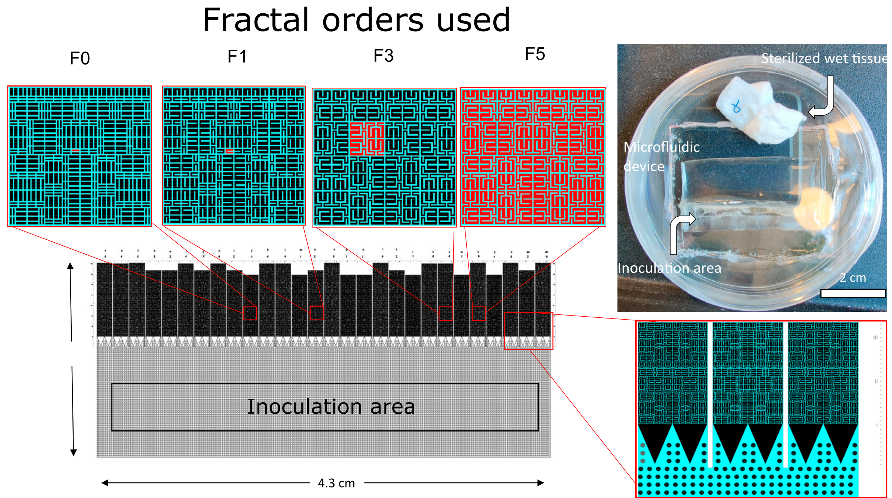

# Abstract

This project implements a Lotka—Volterra model to analyse time series growth data, derive interaction coefficients and explore how a three-species interaction can be modeled from limited growth data of only two of the three species framing the third species as a perturbation to the interaction of the others. Fluorescently labeled *Pseudomonas putida* and *Bacillus subtilis* bacteria were co-cultured with a non-labeled *Trichoderma viride* fungus in micro-scale mazes with different degrees of fractal complexity. The R package `gauseR` [@muhlbauerGauseRSimpleMethods2020] was employed to fit logistic growth curves to the experimental data and calculate interaction coefficients ($a_{ii}, a_{jj}, a_{ij}, a_{ji}$), growth rates ($r$) and carrying capacities ($K$).

# Introduction

## Importance of community and habitat complexity in microbial ecology

In microbial ecology, most experimental research is focused on either community response to a generalized change in ecosystem properties (e.g. temperature, pH, nutrient availability, toxins) by characterizing communities on a very broad and data generation driven "-omics" approach with limited reconnaissance for functional and mechanistic processes, or it focuses on two species interactions — of oftentimes synthetic consortia — with limited transferability to *in situ* complexity, neglecting the emergence of ecosystem properties and higher order interactions in interaction networks of complex communities .\
Moreover, most of this culturing-technique based approaches is based entirely on well-mixed "on a shaker"-type conditions. This poses great challenges for the study of community driven effects with relevance of the spatial arrangement like biofilm formation, quorum sensing or niche differentiation [@orrCoexistenceTheoryMicrobial2025]. This is especially limiting for the study of soil habitats, since they are characterized by a very high spatial complexity and thus habitat diversity. On a side-note, the underrepresentation of community complexity and spatial structure might be part of the explanation for the uncultureability-problem that experimental microbiological research is facing since it's very beginnings.\
\
*P. putida* and *B. subtilis* are often co-isoloated from soil samples and *T. viride* is also a common member of soil microbial communities. Therefore all three species are thought to be stably coexisting in soil habitats under natural conditions. The underlying question of these experiments specifically are how *T. viride* affects the growth of *P. putida* and *B. subtilis* facilitating or hindering coexistence, by suppression or support of one or both of the species or by altering the interactions between the two.

## Old but gold: The simple yet powerful framework of the Lotka—Volterra equation

The Lotka-Volterra equation is while being a mathematically relatively simple differential equation still a very powerful approach in ecology that can account for very complex and multi-layered networks of interactions without the need to have a complete mechanistic understanding of these interactions on a molecular level. The canonical framework of\
The basic Lotka—Volterra equation employed throughout this study describes the changes per unit time in the abundance of species $N_{i}$ as

$$
\frac{\mathrm{d}N_{i}}{\mathrm{d}t} = N_{i} (r_{i} + \mathrm{a}_{ii} N_{i} + \sum_{j} (\mathrm{a}_{ij} N_{j}))
$$ {#eq-lv}

with $r_{i}$ as the intrinsic growth rate, $\mathrm{a}_{ii}$ being the intra-specific competition (i.e. the effect of species $i$ on itself, $\mathrm{a}_{ij}$ describing the effect of species $j$ on species $i$ and $N_{j}$ as the abundance of species $j$.

With the approach to reflect the interaction dynamics of this three species system in a simple Lotka-Volterra model I am trying to approximate on the dynamics with a simple model approach to see whether experimental data can be fitted satisfyingly on this degree of complexity already or if more sophisticated models need to be employed. Also the attempt to model the data with a LV model can give insights if the interactions can be described by transient competition or if higher-order interactions are at work.

In this experimental setup time series growth data is only available for two of the three species.\
The overal aim is to see whether the experimental data can be properly represented by a Lotka-Voltera model and investigate if that approach is a viable method to narrow in on mechanistic insights to the interactions of this three species model in a spatially structured habitat.

Generalized LV:

$$
\frac{\mathrm{d}x_{i}(\mathbf{t})}{\mathrm{d}\mathbf{t}}=\mathbf{x}_{i}(\mathbf{t})\left(\mathbf{b}_{i}+\sum_{j=1}^{n}\mathbf{a}_{ij}x_{j}(\mathbf{t})\right)\qquad{i}=1,\ldots,n
$$

# Methods and Data

## Experimental methods

The wet lab experimental setup consists of a semi-continous culturing experiment on microfluidic chips comprised with micro-scale mazes of different fractal complexity (f0-f5, Hilbert curve space filling design; @hilbertUeberStetigeAbbildung1935) and normalized internal volume. The chips consist of a culture/media inoculation area from where mazes branch off [@fig-chip].

*P. putida* and *B. subtilis* have a genomically integrated expression cassette for green- and red-fluorescent protein (GFP/RFP) production respectively. Fluorescence intensity levels are used as a proxy for species abundance throughout this study.\
Culturing experiments were carried out over 22 days with a 48 h media-replenishment cycle replicating close-to unlimited nutrient supply conditions (M9 minimal medium). In the same cycle the mazes were imaged by epi-fluorescence microscopy collecting spatially resolved GFP and RFP signals to approximate species abundance.

{#fig-chip fig-align="center"}

## Software and Code

The main analysis was carried out using R version 4.6.1. The Lotka—Volterra modeling was done using the `gauseR` package version 1.3. Additionally the following software was used for data wrangling,processing and report compiling: ImageJ 1.54 (raw TIFF microscopy image data processing), RStudio 2026.09.0 Build 174 (main IDE), quarto 1.10.18 (report writing and rendering), pandoc 3.7.0.2 (report pdf rendering), LuaHBTeX 1.24.0 (TeX Live 2026, as pandoc compiler).\
Additional R packages used apart form R `base` were: `tidyverse`, `ggh4x`, `kableExtra`, `readxl`.

## Data analysis and modeling workflow

Raw microscopy images were alingned and processed by background substraction using an ImageJ rolling ball algorithm with the rolling ball diameter matching the width of the maze channels.

- your workflows; BUT: usually no command lines

# Results

```{r}
# Load dependencies

library(tidyverse)
library(gauseR)
library(ggh4x)        # per-column coloured strips
library(kableExtra)   # PDF tables
library(readxl)

options(knitr.kable.NA = "\u2013")   # missing values shown as "–"
# `summary_df` is assumed to be loaded already
# (columns: ch, time, fractal, species [= condition], mean_value, sd, n, se)
```

```{r}
# Import raw data and process

path <- "~/Documents/MSc_MMEI/MA/data/maryam_data"

df <- list.files(path, pattern = "^rep\\d+\\.xlsx$", full.names = TRUE) |>
  lapply(function(file) {
    data <- read_excel(file)
    data$rep <- as.integer(sub("rep(\\d+)\\.xlsx", "\\1", basename(file)))
    data
  }) |>
  bind_rows()

df <- setNames(df, c("position", "area", "mean", "min", "max", "ch", "time", "chip", "fractal", "rep"))

# Convert timepoints to days after inoculation
df$time <- df$time*2 

# Set Conditions
df$species <- dplyr::recode(
  df$chip,
  "1" = "T+B",
  "2" = "T+P",
  "3" = "T+P+B",
  "4" = "B",
  "5" = "P",
  "6" = "P+B",
  "7" = "T+B",
  "8" = "T+P",
  "9" = "T+P+B",
  "10" = "B",
  "11" = "P",
  "12" = "P+B",
  "13" = "P+B",
  "14" = "B",
  "15" = "T+B",
  "16" = "P",
  "17" = "T+P",
  "18" = "P+B",
  "19" = "T+P+B",
  "20" = "B",
  "21" = "T+B",
  "22" = "P",
  "23" = "T+P",
  "24" = "P+B",
  "25" = "T+P+B"
)

# Import CFU dataset
# CFU <- read_excel("~/Documents/MSc_MMEI/MA/data/maryam_data/CFU.xlsx")

# Calculate summary statistics.
summary_df <- df %>% 
  group_by(ch, time, fractal, species) %>%
  summarise( mean_value = mean(mean, na.rm = TRUE), 
             sd = sd(mean, na.rm = TRUE), n = n(), se = sd / sqrt(n), .groups = "drop" 
             )
```

```{r}
#| eval: false

# Export to csv. Future analyses can be carried out starting by importing the csv from below.
write.csv(df, "df_chips_maryam.csv", row.names = FALSE)
write.csv(summary_df, "df_chips_maryam.stat.csv", row.names = FALSE)

# Import CSV
df <- read.csv ("df_chips_maryam.csv")
summary_df <- read.csv ("df_chips_maryam.stat.csv")
```

```{r}
#| label: config

# Experimental Setup Configuration
#---------------------------------
#
# One row per species code that can occur in a condition string ("T+P+B").
#  - channel = NA  -> species is part of the community but NOT measured (T)
#  - name          -> used in legend and table headers
species_info <- tribble(
  ~species, ~channel, ~name,          ~colour,   ~linetype, ~shape,
  "P",      "G",      "P. putida",    "#1B7837", "solid",   16,
  "B",      "R",      "B. subtilis",  "#762A83", "42",      17,
  "T",      NA,       "T (name?)",    NA,        NA,        NA
)

# Which conditions appear as figure columns (in this order).
# Everything is fitted and goes into the tables regardless.
plot_conditions <- c("P", "B", "P+B", "T+P+B")

# Preferred order of conditions in the tables; conditions not listed are
# appended alphabetically, listed-but-absent ones are ignored.
condition_order <- c("P", "B", "P+B", "T+P", "T+B", "T+P+B")

# Column tints (recycled if you plot more conditions)
bg_palette <- c("#9CC3E6", "#E8A99A", "#9FD6AE", "#EBCB7F", "#C9B5E0", "#9ED3D3")

# ---- derived helpers (no edits needed) -------------------------------------
tr             <- species_info |> filter(!is.na(channel))
tracked        <- tr$species                       # fixed a_ij / r_i index order
species_colors <- set_names(tr$colour,   tr$species)
species_ltys   <- set_names(tr$linetype, tr$species)
species_shapes <- set_names(tr$shape,    tr$species)
species_names  <- set_names(tr$name,     tr$species)

split_cond <- function(x) strsplit(x, "+", fixed = TRUE)[[1]]
cond_short <- function(x) str_remove_all(x, "\\+")                 # "T+P+B" -> "TPB"
cond_full  <- function(x, fmt = c("plain", "latex")) {             # "P+B" -> "P. putida + B. subtilis"
  fmt <- match.arg(fmt)
  map_chr(x, \(cnd) {
    codes <- split_cond(cnd)
    nm <- coalesce(species_info$name[match(codes, species_info$species)], codes)
    if (fmt == "latex") nm <- paste0("\\textit{", nm, "}")
    paste(nm, collapse = " + ")
  })
}
```

```{r}
#| label: canonical

# 1. Canonical long layout
#-------------------------
#
# Every downstream step relies on this layout:
# `condition | fractal | time | species | mean_value | sd | se | n`
# (one row per condition x fractal x time x *measured* species).

canonical <- summary_df |>
  rename(condition = species) |>                                  # your "species" column holds the condition
  inner_join(tr |> select(species, channel), by = c("ch" = "channel")) |>  # channel -> species
  # keep only the channel(s) that belong to the species present in that condition
  filter(map2_lgl(species, condition, \(s, cnd) s %in% split_cond(cnd))) |>
  mutate(fractal = factor(paste0("f", fractal),
                          levels = paste0("f", sort(unique(fractal))))) |>
  select(condition, fractal, time, species, mean_value, sd, se, n) |>
  arrange(condition, fractal, species, time)

stopifnot(!anyDuplicated(canonical[c("condition", "fractal", "time", "species")]))

all_conditions <- intersect(union(condition_order, sort(unique(canonical$condition))),
                            unique(canonical$condition))
```

```{r}
#| label: fit
#| message: false

## 2. Fit every condition x fractal
#----------------------------------
#
# Fit one condition x fractal. Species columns are ordered like `tracked`,
# so the fitted index -> global index mapping is stable.
fit_gause <- function(d) {
  wide <- d |>
    select(time, species, mean_value) |>
    pivot_wider(names_from = species, values_from = mean_value) |>
    arrange(time)
  sp <- tracked[tracked %in% names(wide)]
  gause_wrapper(time = wide$time, species = as.data.frame(wide[sp]), doplot = FALSE)
}

fits <- canonical |>
  group_by(condition, fractal) |>
  nest() |>
  ungroup() |>
  mutate(
    sp  = map(data, \(d) tracked[tracked %in% d$species]),
    res = map(data, safely(fit_gause)),
    fit = map(res, "result"),
    err = map_chr(res, \(r) if (is.null(r$error)) NA_character_ else conditionMessage(r$error))
  )

failed <- filter(fits, !is.na(err))
if (nrow(failed)) {
  warning("Fits failed for: ",
          paste(failed$condition, failed$fractal, sep = "/", collapse = ", "), "\n",
          paste(unique(failed$err), collapse = "\n"))
}
fits_ok <- filter(fits, is.na(err))

# Diagnostic if something looks off (run interactively):
# str(fits_ok$fit[[1]], max.level = 1); fits_ok$fit[[1]]$parameter_intervals
```

```{r}
#| label: extract

# 3. Extract predictions, parameters and goodness of fit
#--------------------------------------------------------
#
extract_predicted <- function(fit, sp) {
  out <- as.data.frame(fit$out)
  out <- out[c("time", setdiff(names(out), "time"))]
  stopifnot(ncol(out) == length(sp) + 1)
  names(out) <- c("time", sp)                      # species order as passed to the fit
  pivot_longer(out, -time, names_to = "species", values_to = "N")
}

# ALL parameters (r_i and a_ij), re-indexed from "position within this fit"
# to the GLOBAL species index, so a B monoculture reports a22 / r2 (not a11 / r1).
extract_params <- function(fit, sp) {
  idx <- match(sp, tracked)
  # local index (position in this fit) -> global index, one name at a time
  # (scalar logic: no vector recycling that could go wrong)
  reindex <- function(p) {
    if (str_detect(p, "^r[0-9]$") || str_detect(p, "^a[0-9]{2}$")) {
      d <- as.integer(str_extract_all(p, "[0-9]")[[1]])
      paste0(str_sub(p, 1, 1), paste(idx[d], collapse = ""))
    } else p                                             # unknown names pass through unchanged
  }
  fit$parameter_intervals |>
    as.data.frame() |>
    rownames_to_column("parameter") |>
    mutate(parameter = map_chr(parameter, reindex),
           i = suppressWarnings(as.integer(str_sub(parameter, 2, 2))),   # NA for non r/a names
           j = suppressWarnings(as.integer(str_sub(parameter, 3, 3)))) |>  # NA for r_i
    select(parameter, i, j, lower_sd, mu, upper_sd)
}

predicted <- fits_ok |>
  mutate(pred = map2(fit, sp, extract_predicted)) |>
  select(condition, fractal, pred) |>
  unnest(pred)

params <- fits_ok |>
  mutate(par = map2(fit, sp, extract_params)) |>
  select(condition, fractal, par) |>
  unnest(par)

coefs <- filter(params, str_starts(parameter, "a"))   # interaction coefficients only (table 1)

observed <- canonical   # already in the right shape (incl. se for error bars)

# Goodness of fit per condition x fractal x species: predicted curve is
# interpolated at the observed time points and compared with the observed means.
gof <- observed |>
  semi_join(fits_ok, by = c("condition", "fractal")) |>
  group_by(condition, fractal, species) |>
  group_modify(\(d, key) {
    pr   <- filter(predicted, condition == key$condition,
                   fractal == key$fractal, species == key$species)
    yhat <- approx(pr$time, pr$N, xout = d$time)$y
    ok   <- is.finite(yhat)
    res  <- d$mean_value[ok] - yhat[ok]
    tibble(n_obs = sum(ok),
           rmse  = sqrt(mean(res^2)),
           r2    = 1 - sum(res^2) / sum((d$mean_value[ok] - mean(d$mean_value[ok]))^2))
  }) |>
  ungroup()
```

Here begins the text describing the results

First figure:

```{r}
#| output: true
#| label: fig-rfp-f5
#| fig-cap: RFP (solid line) and GFP (dashed line) flourescence intensity on microfluidic mazes with fractal order 5.


summary_df %>%
  ggplot(aes(x = time, color = species)) + 
  #geom_line(data=subset(summary_df, ch =='R'), aes(y = mean_value)) +
  geom_line(data=subset(summary_df, ch == 'G'& fractal == '5'), aes(y = mean_value), linetype = "dashed") +  
  geom_line(data=subset(summary_df, ch == 'R'& fractal == '5'), aes(y = mean_value)) +
  geom_errorbar(data=subset(summary_df, ch == 'G'& fractal == '5'), aes(ymin = mean_value - se, ymax = mean_value + se), width = 0.3 ) + 
  geom_errorbar(data=subset(summary_df, ch == 'R'& fractal == '5'), aes(ymin = mean_value - se, ymax = mean_value + se), width = 0.3 ) + 
  theme_light() +
  labs(y = "RFP/GFP intensity",
       x ="time [days]")
```

Second figure:

```{r}
#| label: fig-growth-grid
#| output: true
#| fig-width: 8
#| fig-height: 7
#| fig-cap: "Observed (points, ±SE) and predicted (lines) growth curves across fractal levels (rows) and conditions (columns)."

col_levels <- cond_short(plot_conditions)
bg <- set_names(rep_len(bg_palette, length(col_levels)), col_levels)

prep_plot <- function(df) {
  df |>
    filter(condition %in% plot_conditions) |>
    mutate(condition_label = factor(cond_short(condition), levels = col_levels))
}
predicted_p <- prep_plot(predicted)
observed_p  <- prep_plot(observed)

p <- ggplot() +
  # column background; no `fractal` column -> recycled into every row
  geom_rect(
    data = tibble(condition_label = factor(col_levels, levels = col_levels)),
    aes(xmin = -Inf, xmax = Inf, ymin = -Inf, ymax = Inf, fill = condition_label),
    alpha = 0.5, show.legend = FALSE
  ) +
  geom_line(data = predicted_p,
            aes(time, N, colour = species, linetype = species), linewidth = 0.7) +
  geom_linerange(data = observed_p,
                 aes(time, ymin = mean_value - se, ymax = mean_value + se, colour = species),
                 linewidth = 0.3) +
  geom_point(data = observed_p,
             aes(time, mean_value, colour = species, shape = species), size = 1.6) +
  ggh4x::facet_grid2(
    fractal ~ condition_label,
    strip = ggh4x::strip_themed(
      background_x = ggh4x::elem_list_rect(fill = scales::alpha(unname(bg), 0.5)),
      background_y = ggh4x::elem_list_rect(fill = "grey20"),
      text_x = ggh4x::elem_list_text(face = "bold", colour = "grey15"),
      text_y = ggh4x::elem_list_text(face = "bold", colour = "white")
    )
  ) +
  scale_fill_manual(values = bg, guide = "none") +
  scale_colour_manual(values = species_colors,  labels = species_names, limits = tracked, name = "Species") +
  scale_linetype_manual(values = species_ltys,  labels = species_names, limits = tracked, name = "Species") +
  scale_shape_manual(values = species_shapes,   labels = species_names, limits = tracked, name = "Species") +
  scale_x_continuous(n.breaks = 3) +
  labs(x = "Time [days]", y = "Population size N [fluorescence intensity]") +
  theme_minimal(base_size = 11) +
  theme(
    panel.grid.minor = element_blank(),
    panel.grid.major = element_line(colour = "grey88", linewidth = 0.25),
    panel.spacing.x  = unit(10, "pt"),
    panel.spacing.y  = unit(3,  "pt"),
    strip.placement  = "outside",
    axis.text        = element_text(size = 7, colour = "grey30"),
    axis.title       = element_text(size = 9.5),
    axis.ticks       = element_line(colour = "grey70", linewidth = 0.25),
    legend.position  = "bottom",
    legend.title     = element_text(size = 9, face = "bold"),
    legend.text      = element_text(size = 8),
    plot.margin      = margin(6, 6, 6, 6)
  )

p

# ggsave("growth_curve_figure.pdf", p, width = 6.5, height = 7, units = "in")
```

Heatmap of interaction coefficients

```{r}
#| label: fig-heatmap
#| output: true
#| fig-width: 6.5
#| fig-height: 3.6
#| fig-cap: "Interaction coefficients per fractal level (rows) and condition (columns). Tile colour shows the estimated coefficient (blue: positive, red: negative); colour saturation shows $R^2$ of the fit of the species whose growth equation contains the coefficient (faint = poor fit). Numbers are the coefficient values."

# Conditions shown (default: all, like the table; e.g. use plot_conditions to restrict)
hm_conditions <- all_conditions

# column order within a condition, same as the table: a11, a22, a12, a21
coef_levels <- coefs |>
  distinct(parameter, i, j) |>
  arrange(i != j, i, j) |>
  pull(parameter)

heat <- coefs |>
  mutate(species = tracked[i]) |>              # a_ij belongs to the growth equation of species i
  left_join(select(gof, condition, fractal, species, r2),
            by = c("condition", "fractal", "species")) |>
  filter(condition %in% hm_conditions) |>
  mutate(condition_label = factor(cond_short(condition), levels = cond_short(hm_conditions)),
         parameter = factor(parameter, levels = coef_levels),
         r2_clamped = pmin(pmax(r2, 0), 1),      # negative R2 -> 0 (faintest)
         label = formatC(mu, format = "g", digits = 2))

m <- max(abs(heat$mu), na.rm = TRUE)             # symmetric limits: white = 0

sigma <- median(abs(heat$mu), na.rm = TRUE)

ggplot(heat, aes(x = parameter, y = fct_rev(fractal))) +
  geom_tile(aes(fill = mu, alpha = r2_clamped), colour = "white", linewidth = 0.6) +
  geom_text(aes(label = label), size = 2.2, colour = "grey15") +
  facet_grid(. ~ condition_label, scales = "free_x", space = "free_x") +
  scale_fill_gradient2(
    low = "#B2182B", mid = "white", high = "#2166AC",
    midpoint = 0, limits = c(-m, m), name = "Coefficient",
    transform = scales::pseudo_log_trans(sigma = sigma)) +
  scale_alpha_continuous(range = c(0.3, 1), limits = c(0, 1), name = expression(R^2)) +
  scale_x_discrete(position = "top",
                   labels = \(x) parse(text = sprintf("italic(a)[%s]", str_sub(x, 2)))) +
  guides(alpha = guide_legend(override.aes = list(fill = "grey30"))) +
  labs(x = NULL, y = NULL) +
  theme_minimal(base_size = 10) +
  theme(
    panel.grid      = element_blank(),
    strip.placement = "outside",                   # condition strip above the coefficient labels
    strip.background = element_rect(fill = "grey92", colour = NA),
    strip.text      = element_text(face = "bold", colour = "grey15"),
    panel.spacing.x = unit(8, "pt"),
    axis.text       = element_text(colour = "grey25"),
    legend.position = "bottom",
    legend.title    = element_text(size = 8, face = "bold"),
    legend.text     = element_text(size = 7)
  )
```

## Lotka—Volterra modeling using the `gauseR` library

### Parameterization and regression fit for *Pseudomonas* monoculture

Time-lagged data was generated using the `get_lag` function and the obtained data was used to calculate the per-capita growth rate.\
The per-capita growth rate for the logistic growth model was defined as:

$$ \frac{\mathrm{d}N}{\mathrm{d}t} / N = r - a_{ii} N $$

with $r$ being the intrinsic growth rate, and $a_{ii}$ the self-limitation in growth of the species.

The per-capita growth rate was plotted against the abundance and a linear regression was fitted to obtain the needed parameters $r$ (read as the y-intercept) and $K$ (read as the x-intercept). $a_{ii}$ is the slope of the linear regression.

# Discussion

- Discussion (did we succeed w.r.t. the project aims? did we make particular assumptions? do our methods have weaknesses? how do the results compare to previous expectations and previous work)

# Statement of authorship, contributions and use of LLMs

This report is submitted as the practical project for the class "Practial Course in Modelling and Systems Biology" (2026S 300332-1). I originally wanted to conduct the modeling analyses with my own masters thesis data from co-culturing experiments with *P. putida*, *B. subtilis* and a complex soil bacterial community isolated from soil samples as a natural inoculum. However, since I was unable to have the necessary experimental data ready in time for the due date of this report I herein use the data of my colleague Maryam Al-Jalahwee, BSc who conducted similar experiments with *Trichoderma viride* as the third interaction entity. All data arranging, sorting and subsequent analysis has been conducted by the author.

I used CLAUDE *Sonnet 5* and OpenAI GPT-5.6 *Luna* for generation and improvements of R code. In particular I used it for the building of functions to automate my data processing pipeline for all the different conditions and fractal levels I have in my data, for bug fixing, efficiency improvements on the code I provided and for configuring layout, design and arrangement of plots and tables. I also used it to help me better understand the functionality of the `gauseR::test_goodness_of_fit` functionality.

# References

::: {#refs}
:::

# Supplementary Material

The complete code that contains all data handling and also compiles this report reproducibly can be found as a Quarto document [GitHub](https://github.com/lekuehne/masterThesis/blob/main/SysBioModelingClass.qmd).

```{r}
#| label: tbl-lv-coeff
#| output: true
#| tbl-pos: H
#| tbl-cap: "Estimated Lotka-Volterra interaction coefficients for cocultures of *P. putida* (1) and *B. subtilis* (2) on microfluidic chips with mazes of increasing fractal complexity (f0-f5). $a_{11}$ and $a_{22}$ are the intra-specific effects of *P. putida* and *B. subtilis*, respectively; $a_{12}$ and $a_{21}$ are the inter-specific effects of *B. subtilis* on *P. putida* and vice versa. Negative coefficients indicate competition/inhibition, positive coefficients promotion/enhancement."

tab_long <- coefs |>
  mutate(condition = factor(condition, levels = all_conditions),
         col = paste(condition, parameter, sep = "|")) |>
  arrange(condition, i != j, i, j)          # a11, a22, a12, a21 within each condition

tab_wide <- tab_long |>
  select(fractal, col, mu) |>
  pivot_wider(names_from = col, values_from = mu) |>   # column order = order of appearance
  arrange(fractal)

col_meta <- tab_long |>
  distinct(col, condition, parameter)
col_meta <- col_meta[match(names(tab_wide)[-1], col_meta$col), ]   # same order as table columns

grp <- count(col_meta, condition)                                  # columns per condition
top <- c(" " = 1, set_names(grp$n, cond_full(as.character(grp$condition), "latex")))

tab <- tab_wide |>
  kbl(format = "latex", booktabs = TRUE, digits = 4, align = "c", escape = FALSE,
      col.names = c("Fractal", sprintf("$a_{%s}$", str_sub(col_meta$parameter, 2)))) |>
  add_header_above(top, line = TRUE, escape = FALSE) #%>% # rule under each condition group
  # kable_styling(latex_options = c("landscape", "scale_down", "HOLD_position"))

knitr::asis_output(
  paste0("\\centering\n",
         "\\rotatebox{90}{\\resizebox{0.9\\textheight}{!}{",
         tab,
         "}}")
)

```

```{r}
#| label: tbl-gof
#| output: true
#| tbl-cap: "Goodness of fit of the fitted growth curves against the observed means, per species. $R^2 = 1 - SS_\\mathrm{res}/SS_\\mathrm{tot}$ (can be negative for fits worse than the mean); RMSE in the units of $N$ (fluorescence intensity). Model predictions were interpolated at the observed time points."

sp_present <- tracked[tracked %in% gof$species]
gof_cols   <- as.vector(t(outer(sp_present, c("r2", "rmse"), paste, sep = "|")))

gof_wide <- gof |>
  mutate(condition = factor(condition, levels = all_conditions),
         species   = factor(species, levels = sp_present)) |>
  arrange(condition, fractal) |>
  pivot_wider(id_cols = c(condition, fractal), names_from = species,
              values_from = c(r2, rmse), names_glue = "{species}|{.value}") |>
  select(condition, fractal, all_of(gof_cols)) |>
  mutate(condition = cond_full(as.character(condition), "latex"),
         fractal   = as.character(fractal))

gof_wide |>
  kbl(format = "latex", booktabs = TRUE, digits = 3, align = "llcccc", escape = FALSE,
      col.names = c("Condition", "Fractal", rep(c("$R^2$", "RMSE"), length(sp_present)))) |>
  add_header_above(c(" " = 2,
                     set_names(rep(2, length(sp_present)),
                               paste0("\\textit{", species_names[sp_present], "}"))),
                   line = TRUE, escape = FALSE) |>
  collapse_rows(columns = 1, latex_hline = "major", valign = "top") |>
  kable_styling(font_size = 9)
```

```{r}
#| label: tbl-confidence
#| tbl-cap: "Parameter estimates with uncertainty for every fit. $r_i$: intrinsic growth rate of species $i$; $a_{ij}$: interaction coefficients (indices as in Table 1). SD is half the width of the ±1 SD interval returned by gauseR; the 95\\% interval is the normal approximation (estimate ± 1.96 SD). 'Excludes 0' indicates whether this interval excludes zero."

param_out <- params |>
  mutate(
    condition = factor(condition, levels = all_conditions),
    sd = abs(upper_sd - lower_sd) / 2,
    lo = mu - 1.96 * sd,
    hi = mu + 1.96 * sd
  ) |>
  arrange(condition, fractal, str_starts(parameter, "a"), coalesce(i != j, FALSE), parameter) |>
  transmute(
    Condition = cond_full(as.character(condition), "latex"),
    Fractal   = as.character(fractal),
    Parameter = sprintf("$%s_{%s}$", str_sub(parameter, 1, 1), str_sub(parameter, 2)),
    Estimate  = sprintf("%.4f", mu),
    SD        = sprintf("%.4f", sd),
    Interval  = sprintf("[%.4f, %.4f]", lo, hi),
    Excl0     = if_else(lo > 0 | hi < 0, "yes", "no")
  )

param_out |>
  kbl(format = "latex", booktabs = TRUE, digits = 3, longtable = TRUE, escape = FALSE,
      align = "llcrrrc", row.names = FALSE,
      col.names = c("Condition", "Fractal", "Parameter", "Estimate", "SD",
                    "95\\% interval", "Excludes 0")) |>
  collapse_rows(columns = 1:2, latex_hline = "major", valign = "top") |>
  kable_styling(latex_options = "repeat_header", font_size = 8)
```
