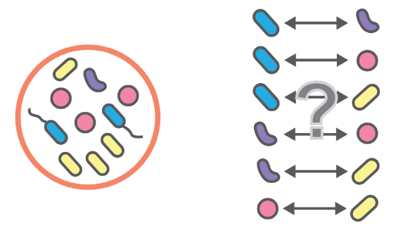

# When strangers join the party... 
## How Microhabitat Complexity And Community Context Shape Bacterial Interactions

# Why bother? {.center}

## Microorganisms shape the foundation of ecosystems and macroecolgy {.smaller}
:::: columns

::: {.column width="50%" .incremental}

- Interactions drive functional properties of microbiomes
- Emergent properties of microbial communities
:::

::: {.column width="50%" .incremental}

Picture

- Diversity maintains microbiome function — but how?
- Mechanistic understanding helps to better predict, protect & preserve ecosystems
- Soil: most diverse and complex habitat — therefore hard to simplify to ecological principles

:::
::::

::: footer
[@arellano-caicedo2023], [@chang2023]
Arellano-Caicedo et al. (2023), Chang et al. (2023), Mafla-Endara et al. (2021), Magnabosco et al. (2018), Tecon & Or (2017)

:::

::: notes
- Microbes are **everywhere** 
- Microbes accounting for **most biomass on earth**

- Driver of a multitude of metabolic processes, nutrient cycling and symbiotic relationships with higher-organisms
- Metabolic backbone of ecosystems, shape the foundation of all ecosystem properties
- Soil microbes play intricate role in global carbon storage and turnover

- Community composition and **interactions between microbes** **drive functional properties** of microbiomes and subsequent macroecological processes 
- **Functional microbiomes lead to functional ecosystems**
- Better understanding microbial interactions helps in translating to concepts like competition, cooperation, coexistence and also cross-feeding, keystone taxa and tipping points, which in turn help to predict, protect & preserve ecosystem function 
%%
#### Applications
- Understanding communities better to predict, protect & preserve (from anthropogenic influnce)
- could include
	- Bioremediation (degradation and neutralization of pollutants, like hydrocarbons, heavy metals and plastics)
	- Agriculture (soil microbiome intervention for pathogen control,  enhanced nutrient cycling) wastewater treatment, human and animal health (gastroenterology, probiotics, dermatology)

	- Translating ecological interaction into principles (competiton, cooperation, coexistance, syntrophy)
	- Cross-feeding, synthropic networks, quorum sensing, biofilm formation
	- Identification of keystone taxa
	- Tipping point prediction
	-  Linking microbial interactions to ecosystem **resistance & stability**
%%
#### Diversity & Emergent Properties
- Diversity is important to maintain microbiome functions
- Challenging to know how to preserve diversity when we don't know how it’s mediated
- Interplay of microbial taxa gives rise to emergent properties of theses communities and networks - cannot be characterized fully by pairwise interactions (naming examples of functional properties of communites)

- Soil among most complex habitat found on earth in terms of functional & genomic diversity
- Challenging to study interactions in situ
	- Limited visual access, cultureability
	- Top down vs bottom up approach of characterizing communities without knowing their interactions (or if they interact at all)
		- Top Down: Measuring metabolic activity and genomic diversity of entire communities, trying to identify patterns in response to environmental factors
		- Bottom up: Studying specific bacterial interactions in vitro and **increasing complexity** (environment, habitat, community). 
%%   		- But **experimental reductionism fails to capture complexity of interactions**%%
- Plant-microbe interactions studied a lot microbe-microbe not so much
- Most microbe-microbe studies focus on pairwise interactions
:::

## The Dilemma of Cooperation and Diversity [^2]
- Selection against costly cooperative traits – unless mechanisms maintain them    
- Cooperation can be driver of destabilizing effects by causing dependencies. 
- Competition can be stabilizing by creating negative feedback
- Many species that coexist stably in complex community fail to coexist in pairwise co-culture
- Paradoxical bc of dilemma of cooperation (diversity of soils, taxa)    

::: notes
- Cooperative traits are costly so if there are no mechanistics maintaing them there would be a selection against them
- Coexistence as an emergent phenomenon: Many species that coexist stably in complex community fail to coexist in pairwise co-culture
- Debate about reductionist approach vs. emergence
- Microscopic heterogeneity -> higher microbial density, genomic diversity, substrate preservation

- Costly cooperative traits should be selected against unless mechanisms exist that maintain them
- Many species that coexist stably in complex community fail to coexist in pairwise co-culture, suggesting that coexistence is an emergent phenomenon
- Cooperation can be driver of destabilizing effects by causing dependencies. Competition can be stabilizing by creating negative feedback
%%-  "Soil Microbiome Predictability Increases with Spatial and Taxonomic Scale" %%
- Invasibility, Coexistence & Exclusion, Competition & Attraction
:::
[^2]: Chang et al. (2023), Coyte et al. (2015), Cremer et al. (2019), Palmer & Foster (2022)
---

## 

- Possible causes of this in experimental setups
- niche differences (homogenous) 
- nutrient   
- predators    
- temperature    
- pH    
- everything else (O2, water availability, electron donor/acceptor)    
- fluctuation of the prior(in space and time) → boosts diversity 

- → Diversification of these factors does not retain high diversity (as compared to soil)    
- → Orr et al, Tillmann et al    
- Space can theoretically maintain (infinite) diversity
- Assumptions: dispersion vs. growth rate: Weak competitors colonize empty spaces fast enough (also death reate of fast grower is important to free up space)
- Spatial structure has not been widely studied (Kerr et al/ RockPaperScissor) 
- Single cell resolution (in space & time), dynamic system, replenishment of nutrients, defined spatial structure

---

## Spatial structure allows coexistence between B. subtilis and P. putida
- We don’t know if it applies to more complex community   
- How meaningful/translatable are the results   
- Reflection of in situ??

---

## Research questions
- How is the growth rate and spatial distribution (in a fractal maze) of B. subtilis & P. putida affected by an increase in community complexity from monoculture to pairwise co-culture to co-culture with a complex soil community?
- Is B. subtilis and/or P. putida able to invade into a community of the other leading to stable coexistence, even from low starting frequencies?      
- Does an increased habitat complexity alter their invasibility fitness?

---

## Experimental Approach
### Stepwise increase of complexity to get closer to modeling in situ conditions

---

# Feedback: 
- Microorganisms shape the foundation of ecosystems and macro-ecology — change title of slide to something related to interactions
	- Because of interactions ecosystems have emergent properties but not the interactions are emergent themselves 
- Explain figure on slide 5 more (cooexistence)
- maybe change coexistence and dilemma of diversity slide order?
- On Bs Pp slide make more clear that in unstructured environments Pseudomonas always wins
	- Maybe include back dispersion vs. growth rates
- Make first research question a little more clear (suddenly talking about invasibility but no mention of that before)
- CAVE: Competition only dominates when on simple carbon sources, but no changes to more cooperative when presented complex sources (talk to Moritz for more/see his papers)
- Murr Theory (?) or similar that Ksenia mentioned
- Transition to space as infinite maintainer of niches was not smooth